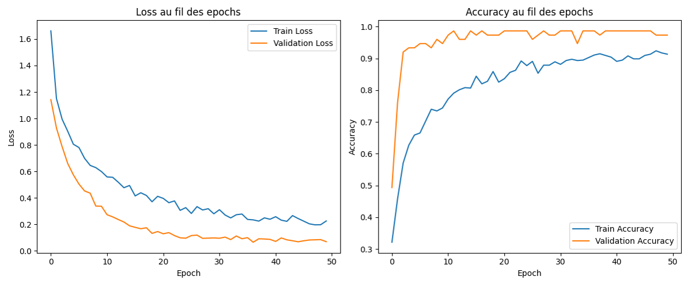
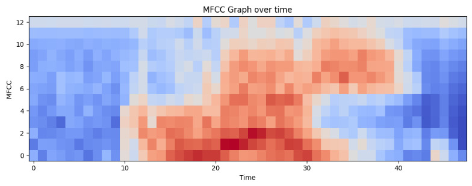

# Neural Speech
Projet électronique utilisant la carte Arduino DUE ARM Cortex-M3 Processor, 32 bit microcontroller avec 84 MHz d'horloge et 96kb de SRAM. Le but ici est de faire une reconnaissance vocale de mots prédéfinis en utilisant les réseaux de neurones convolutionnels. Score obtenu : 18,50 / 20

## Présentation du projet

### Contexte
Ce projet s'inscrit dans le cadre d'un travail académique en électronique et intelligence artificielle. L'objectif est de créer un outil pédagogique et accessible, basé sur une **Arduino Due**, capable de reconnaître des mots prononcés (ex: "bleu", "rouge", "vert") et d'afficher la couleur correspondante via des LEDs, si aucun mot a été reconnu alors allumer la LED "erreur" (jaune).

### Fonctionnalités
- Reconnaissance vocale en temps réel
- Traitement du signal audio (filtre RIF, MFCC)
- Réseau de neurones entraîné avec TensorFlow (précision > 98%)
- Système embarqué autonome (alimentation par batterie)
- Fonctionnalités bonus : détection d'erreurs, ajout de nouvelles couleurs

---

## Architecture technique

### Matériel
- Carte **Arduino Due**
- Microphone MAX9814
- LEDs (rouge, vert, bleu, jaune)
- Bouton poussoir
- Boîtier autonome avec batterie externe

### Logiciel
- **Traitement du signal** : Échantillonnage à 32 kHz, filtre RIF, down-sampling, extraction MFCC
- **Réseau de neurones** : Modèle simple (624 entrées, 4 sorties), entraîné sur 750 enregistrements (4 différentes voix) et testé sur 75 enregistrements
- **Langages** : C++ (Arduino), Python (TensorFlow)

## Résultats et performances

- **Précision du modèle** : 98.46% sur les données de test

- **Temps de détection** : ~3 secondes par mot
- **Visualisation des MFCC** :

> *Exemple de prédiction :*
> | Mot testé | Bleu   | Rouge  | Vert   | Erreur  |
> |-----------|--------|--------|--------|---------|
> | Bleu      | 0.9995 | 0.0000 | 0.0005 | 0.0000  |
> | Rouge     | 0.0000 | 0.9990 | 0.0009 | 0.0000  |
> | Chocolat  | 0.0034 | 0.1284 | 0.0532 | 0.8150  |

---

## Installation et utilisation

### Prérequis
- Arduino IDE
- Bibliothèques : `NeuralNetworks` , `ArduinoMFCC` 
- Python 3.8+ avec TensorFlow
